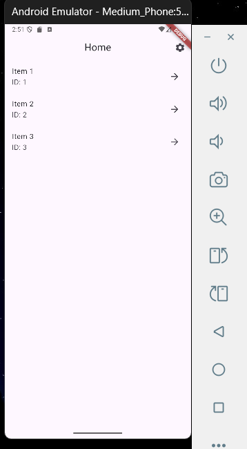
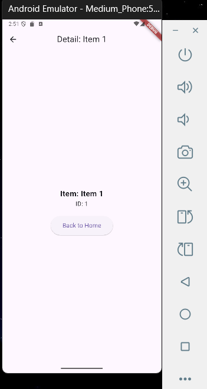
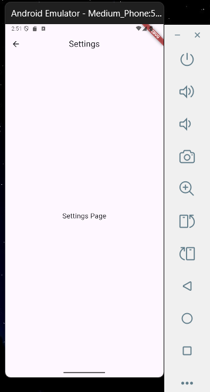

# flutter_deep_link_navigation

## Nama:
Mahardika Rafaditya Dwi Putra Hastomo, NIM: 452210146

## Tujuan Praktikum:
Praktikum ini bertujuan untuk memperkenalkan dan mengimplementasikan **Deep Linking** menggunakan **Navigator 2.0 (Router API)** dalam Flutter. Dengan ini diharapkan dapat memahami:
- Konsep dasar **RouterDelegate** dan **RouteInformationParser**.
- Pengelolaan state navigasi secara eksplisit.
- Implementasi deep linking dan navigasi yang mendukung URL path.
- Pembuatan struktur aplikasi yang skalabel dan fleksibel terhadap kebutuhan navigasi kompleks.

## Deskripsi Aplikasi:
Aplikasi ini adalah contoh aplikasi Flutter yang mengimplementasikan **Deep Linking** dan **Navigator 2 0**. Aplikasi memiliki tiga tampilan utama:
- **HomeScreen**: menampilkan daftar item.
- **DetailScreen**: menampilkan detail dari item yang dipilih.
- **SettingsScreen**: menampilkan halaman pengaturan aplikasi.

## Screenshot Emulator:

## Penjelasan Program:
- Aplikasi dibangun menggunakan **Flutter** dan **Dart**.
- Menggunakan pendekatan **Router API (Navigator 2.0)**:
  - `RouterDelegate` (`AppRouterDelegate`) mengelola logika navigasi dan perubahan halaman.
  - `RouteInformationParser` (`AppRouteInformationParser`) bertugas memetakan URL ke dalam objek rute (`RoutePath`).
- `RoutePath` berfungsi sebagai representasi dari rute logis aplikasi (home, detail, settings).
- Navigasi antar halaman dilakukan dengan memanggil fungsi `selectItem(id)`, `goHome()`, dan `goToSettings()`.
- Terdapat tombol pengaturan di AppBar untuk menuju halaman Settings.
- Tombol back atau pop akan membawa pengguna kembali ke halaman Home dari Detail atau Settings.

## Cara Menjalankan Aplikasi:
flutter pub get flutter run