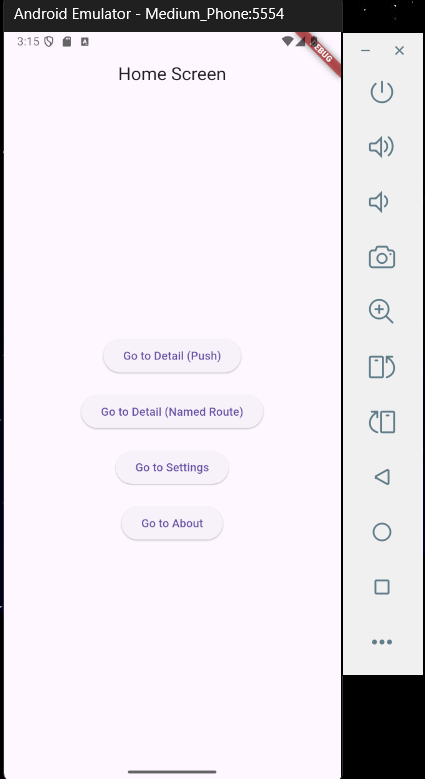
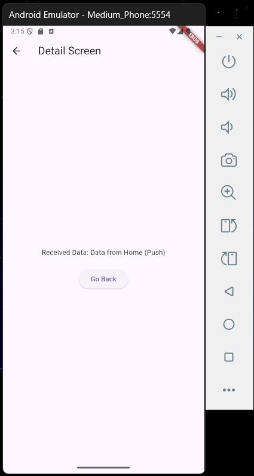
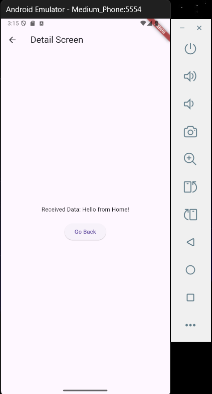
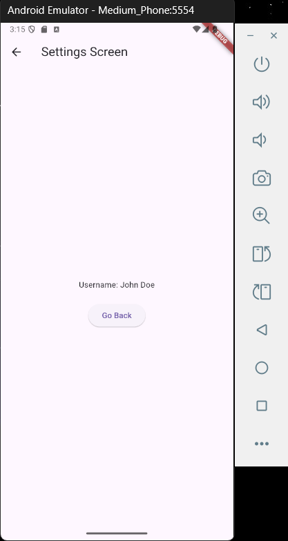
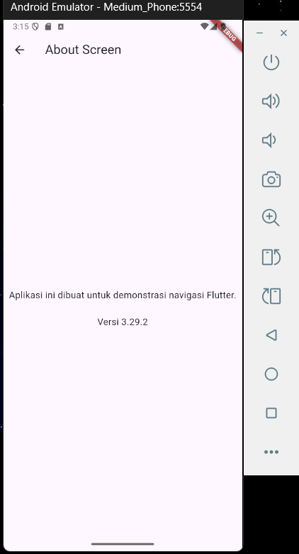

# flutter_navigation

## Nama:
Mahardika Rafaditya Dwi Putra Hastomo, NIM: 452210146

## Tujuan Praktikum:
Praktikum ini bertujuan untuk memahami dan mengimplementasikan navigasi antar halaman (screen) dalam aplikasi Flutter menggunakan **Navigator 1.0** dan **named routes**. Mahasiswa diharapkan mampu membuat aplikasi dengan beberapa halaman, menerapkan Navigator.push, Navigator.pushNamed, serta mengelola data antar layar dengan parameter dan arguments.

## Deskripsi Aplikasi:
Aplikasi ini adalah contoh sederhana navigasi multi-halaman dalam Flutter. Aplikasi terdiri dari 4 halaman utama:
- **Home Screen**
- **Detail Screen**
- **Settings Screen**
- **About Screen**
Pengguna dapat berpindah dari satu halaman ke halaman lainnya menggunakan tombol navigasi yang tersedia. Navigasi dilakukan menggunakan kombinasi `push` dan `pushNamed` pada `Navigator`.

## Screenshot Emulator:

## Penjelasan Program:
- Aplikasi dibuat menggunakan **Flutter** dengan bahasa pemrograman **Dart**.
- Navigasi menggunakan pendekatan **Navigator 1.0**:
  - `Navigator.push()` untuk navigasi langsung dengan parameter konstruktor.
  - `Navigator.pushNamed()` untuk navigasi menggunakan route name.
- Daftar named route didefinisikan dalam `MaterialApp.routes`:
  - `'/'` → `HomeScreen`
  - `'/detail'` → `DetailScreen`
  - `'/settings'` → `SettingsScreen`
  - `'/about'` → `AboutScreen`
- **HomeScreen** menampilkan 4 tombol navigasi:
  - Navigasi ke `DetailScreen` dengan data melalui `push`
  - Navigasi ke `DetailScreen` via named route
  - Navigasi ke `SettingsScreen` dengan `arguments`
  - Navigasi ke `AboutScreen` via named route
- **DetailScreen** menerima parameter `data` secara langsung via konstruktor.
- **SettingsScreen** menerima data `username` melalui `ModalRoute.of(context)?.settings.arguments`.
- **AboutScreen** menampilkan informasi versi dan deskripsi aplikasi.
- UI disusun menggunakan widget dasar seperti:
  - `Scaffold`, `AppBar`, `Column`, `Center`, `Text`, `ElevatedButton`, dan `SizedBox`.

## Cara Menjalankan Aplikasi:
flutter pub get flutter run