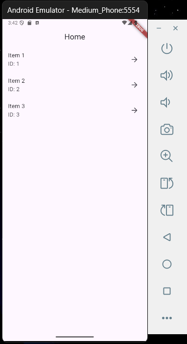
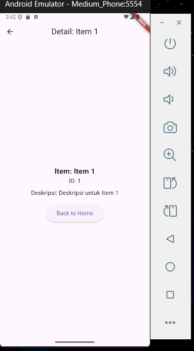

# flutter_navigation_20

## Nama:
Mahardika Rafaditya Dwi Putra Hastomo, NIM: 452210146

## Tujuan Praktikum:
Mengenal dan mengimplementasikan **Navigator 2.0** pada Flutter untuk membuat navigasi halaman (routing) secara deklaratif. Praktikum ini juga melibatkan konsep pemilihan item dan penampilan detail dengan state management sederhana menggunakan `StatefulWidget`.

## Deskripsi Aplikasi:
Aplikasi ini merupakan contoh implementasi navigasi dua halaman (home dan detail) menggunakan `Navigator` versi 2.0. Pengguna dapat memilih sebuah item dari daftar di halaman utama (`HomeScreen`), dan akan diarahkan ke halaman detail (`DetailScreen`) yang menampilkan informasi lengkap dari item tersebut.

Fitur yang tersedia:
  - Menampilkan daftar item (id, nama, deskripsi).
  - Navigasi dari halaman utama ke halaman detail.
  - Tombol kembali dari detail ke halaman utama.
  - Manajemen state pemilihan item secara deklaratif.

## Screenshot Emulator:

## Penjelasan Program:
- Aplikasi dibuat menggunakan **Flutter** dengan bahasa pemrograman **Dart**.
- Navigasi menggunakan pendekatan **Navigator 2.0** (deklaratif):
  - Daftar halaman didefinisikan dalam properti `pages` pada widget `Navigator`.
  - Penambahan halaman dilakukan dengan menyisipkan kondisi pada daftar `pages`.
  - Navigasi mundur (pop) dikendalikan melalui callback `onPopPage`.
- Navigasi halaman:
  - Halaman default adalah `HomeScreen`.
  - Jika ada item yang dipilih (`_selectedItem != null`), maka `DetailScreen` akan ditampilkan.
- **Item** adalah model data yang terdiri dari:
  - `id`: ID unik item.
  - `name`: nama item.
  - `description`: deskripsi dari item.
- **HomeScreen**:
  - Menampilkan daftar item menggunakan `ListView`.
  - Setiap item bisa diklik dan akan memicu navigasi ke halaman detail.
- **DetailScreen**:
  - Menampilkan informasi detail dari item yang dipilih: nama, ID, dan deskripsi.
  - Terdapat tombol “Back to Home” yang memanggil fungsi untuk menghapus item yang dipilih dan kembali ke `HomeScreen`.
- UI disusun menggunakan widget dasar seperti:
  - `MaterialApp`, `Navigator`, `Scaffold`, `AppBar`, `ListTile`, `ListView`, `Center`, `Column`, `Text`, `ElevatedButton`, dan `SizedBox`.

## Cara Menjalankan Aplikasi:
flutter pub get flutter run