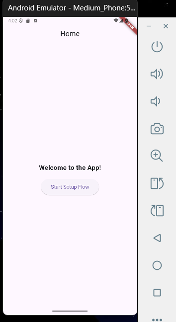

# flutter_nested_navigation

## Nama:
Mahardika Rafaditya Dwi Putra Hastomo, NIM: 452210146

## Tujuan Praktikum:
Mempelajari dan mengimplementasikan navigasi bertingkat (**nested navigation**) menggunakan **Navigator 1.0** di dalam aplikasi Flutter. Praktikum ini juga bertujuan untuk memahami struktur alur kerja kompleks (multi-step flow) menggunakan nested navigator.

## Deskripsi Aplikasi:
Aplikasi ini menyimulasikan proses pengaturan perangkat (setup flow) dengan beberapa langkah: pencarian perangkat, koneksi, dan konfirmasi. Navigasi antar langkah dilakukan dengan **nested `Navigator`** di dalam satu halaman `SetupFlowScreen`.

## Screenshot Emulator:

## Penjelasan Program:
- Aplikasi dibangun menggunakan **Flutter** dan bahasa pemrograman **Dart**.
- Navigasi menggunakan pendekatan **Navigator 1.0**, dengan tambahan **nested navigator** untuk manajemen rute bertingkat:
  - Navigator utama untuk navigasi antar layar utama (`HomeScreen` → `SetupFlowScreen`).
  - Navigator bersarang di `SetupFlowScreen` untuk navigasi antar langkah proses setup.
- Struktur alur setup:
  - `FindDevicesScreen`: Menampilkan pencarian perangkat. Tombol akan menavigasi ke langkah berikutnya.
  - `ConnectDeviceScreen`: Menyimulasikan koneksi ke perangkat. Tombol akan menavigasi ke konfirmasi.
  - `ConfirmDeviceScreen`: Memastikan pengguna ingin menyelesaikan pengaturan.
- Rute internal (nested navigator):
  - `'find_devices'` → `FindDevicesScreen`
  - `'connect_device'` → `ConnectDeviceScreen`
  - `'confirm_device'` → `ConfirmDeviceScreen`
- Setiap langkah diatur menggunakan `Navigator.pushNamed()` pada navigator bersarang (`_navigatorKey.currentState!.pushNamed()`).
- Tombol “Back” menggunakan `Navigator.pop()` untuk kembali ke langkah sebelumnya.
- Setelah proses setup selesai, navigasi kembali ke `HomeScreen` dengan `Navigator.pop(context)`.
- UI dibangun menggunakan widget dasar seperti:
  - `MaterialApp`, `Scaffold`, `AppBar`, `Center`, `Column`, `Text`, `ElevatedButton`, dan `Navigator`.

## Cara Menjalankan Aplikasi:
flutter pub get flutter run